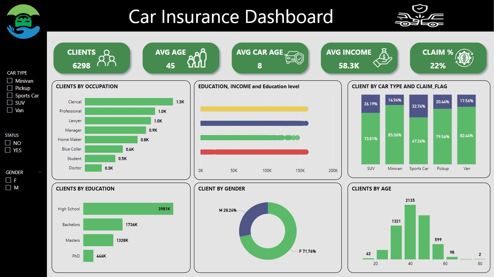

# Car Insurance Data Analysis  

## Overview  
This project focuses on analyzing car insurance data to uncover trends and actionable insights. By combining data cleaning, exploratory data analysis (EDA), and advanced visualization techniques, the project offers valuable metrics that can guide decision-making in the insurance industry.  

## Key Insights  
- **Claim Rate:** 22% of policyholders made claims, a critical metric for understanding customer behavior.  
- **Gender Trends:** Female policyholders were more likely to file claims, a trend with potential implications for customer and risk management strategies.  

## Process and Tools  
1. **Data Cleaning:** Ensured data quality by handling missing values and resolving inconsistencies using Python (Pandas).  
2. **Exploratory Data Analysis (EDA):** Utilized Python libraries such as Matplotlib and Seaborn to identify patterns and key trends.  
3. **Visualization:** Developed interactive and insightful dashboards using Power BI to present findings effectively.  

## Tools and Technologies  
- **Python:** Pandas, Matplotlib, Seaborn  
- **Power BI:** Interactive dashboards and reporting  

## Conclusion  
This project demonstrates how combining Python and Power BI can transform raw data into actionable insights. It highlights the potential of data analytics in addressing real-world challenges in industries 

Portfilio Dashboard: 
